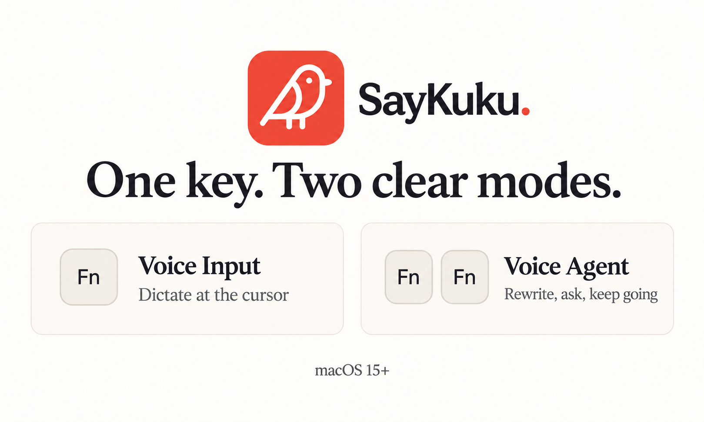

# SayKuku

[简体中文](README.zh-CN.md) · [Download](https://say.anikuku.com/en/download/) · [Setup guide (Chinese)](https://say.anikuku.com/guide/) · [Privacy (Chinese)](https://say.anikuku.com/privacy/)



*Promotional illustration. Actual app screenshots are below.*

SayKuku is a free, native macOS voice app. Press **Fn** to dictate at the cursor; press **Fn twice** to ask Voice Agent to rewrite selected text, translate, answer a question, or continue a conversation. It uses Qwen cloud models, so you bring your own Alibaba Cloud Model Studio API key and pay any model charges on your account.

## Two ways to speak

| Gesture | What happens |
| --- | --- |
| **Fn** | Voice Input transcribes speech and tries to insert the result at the original cursor. Choose hold-to-talk or tap-to-start/tap-to-stop. Adjust language, number formatting, and spoken-word cleanup in Settings. |
| **Fn Fn** | Voice Agent uses your request and the context you allow to rewrite or translate a selection, answer a question, or follow up. It checks the original target before writing. Running a Shortcut requires confirmation; opening a link or searching the web requires confirmation when untrusted context is involved. |

You can also use configurable global shortcuts. The defaults are `⌃⌥⌘V` for Voice Input and `⌃⌥⌘A` for Voice Agent. Writing into another app depends on that app's text controls; check important text before sending it.

## A look at the app


*Home screen from a signed development build. The interface is shown in Simplified Chinese.*


*Privacy settings from a development build. These are real UI screenshots; [the image notes](marketing/assets/screenshots/README.md) describe their source and limits.*

## Get started

You need macOS 15 or newer, an internet connection for Qwen processing, and your own Qwen API key. Model usage may incur charges.

1. [Download the signed, notarized DMG](https://say.anikuku.com/en/download/) and drag SayKuku into Applications.
2. Open the app and allow **Microphone** and **Accessibility** access when guided. Accessibility supports Fn gestures, reading an allowed selection, and writing to another app.
3. Choose the Qwen region that matches your API key, enter the key, and add a Workspace ID if your account uses one. The key is stored in macOS Keychain.
4. Put the cursor in a text field and press **Fn**. Select text and press **Fn twice** to try Voice Agent.

If Fn conflicts with a macOS keyboard setting, follow the in-app guidance or use the configurable global shortcuts. The [setup guide (Chinese)](https://say.anikuku.com/guide/) covers permissions and Qwen configuration.

## More than dictation

- **Memory:** add names, projects, organizations, and terms; import suggestions from pasted text; or approve a correction after dictation. Review or edit saved entries in the Memory page.
- **History:** search, replay saved recordings, retry a failed dictation when audio exists, star entries, and delete records. Voice Agent's recent conversation stays in memory for up to 30 minutes and is cleared on quit.
- **Control:** change input style, overlay position, language, shortcuts, automatic writing, context sources, history retention, and analytics in Settings. The interface supports English and Simplified Chinese.

## Privacy and data

| Data or permission | What SayKuku does |
| --- | --- |
| Microphone | Captures audio only for Voice Input, Voice Agent, or a microphone level test. Voice audio goes to the selected Qwen region; the level test is neither saved nor uploaded. |
| Voice Agent context | Selected text, current app, window title, and visible text in the current window are allowed by default. Clipboard text and the Safari/Chrome page URL are off by default. Each source has a switch in **Settings → Privacy**. Visible text is limited to 2,000 characters and is sent only with that request, without being stored in History or logs. Voice Input does not read screen text. |
| Local data | The API key is in Keychain. History, Memory, and correction suggestions are in Application Support `store.json`; saved recordings are `Audio/*.wav`. JSON and WAV files have no extra encryption. |
| History defaults | New history is kept for 30 days and recording storage is on by default. Starred entries are exempt from automatic deletion. **Settings → History → Don’t keep** stops new history and recordings; it does not delete older entries. |
| Usage analytics | Release builds send a random installation ID, app version, fixed event names, and the character count of completed output to a self-hosted Umami service. No speech, text content, window titles, URLs, or API key is included. This is on by default and can be turned off in **Settings → Privacy**. Development builds and tests do not send it. |
| Update checks | Release builds check a version file after launch and periodically; automatic checks can be turned off in **Settings → General**. Updates open the download page in your browser rather than installing inside the app. |

SayKuku blocks recording and content access in secure text fields and known password managers. Private browsing windows are not detected separately. It does not request Input Monitoring permission or record keystrokes. Read the [full privacy and permissions explanation (Chinese)](https://say.anikuku.com/privacy/) before enabling optional context sources.

## Build and contribute

The project uses Swift 6, SwiftUI, AppKit, and Swift Package Manager, with no third-party Swift package dependencies. It targets macOS 15+; packaging requires Xcode 26 or newer for the macOS 26 SDK.

```bash
swift test
Scripts/package-app.sh debug
open Build/SayKuku.app
```

The debug package requires a stable Apple Development signing identity. `swift run SayKuku` is useful for source-level work, but its process identity and resources do not represent a signed App Bundle; use the packaged app to verify permissions, Keychain access, menu bar behavior, and resources. Default tests do not need a live Qwen API, network, microphone, or Accessibility authorization.

| Area | Where to look |
| --- | --- |
| App and UI | [`Sources/SayKuku/`](Sources/SayKuku/) |
| Tests | [`Tests/SayKukuTests/`](Tests/SayKukuTests/) |
| Product and implementation notes | [`SayKuku.md`](SayKuku.md) |
| Local packaging and release | [`docs/LOCAL_PACKAGING.md`](docs/LOCAL_PACKAGING.md) |
| App analytics and privacy boundaries | [`docs/APP_ANALYTICS.md`](docs/APP_ANALYTICS.md) |
| Compatibility test plan | [`docs/COMPATIBILITY.md`](docs/COMPATIBILITY.md) |
| Mixed-language evaluation | [`docs/MIXED_LANGUAGE_EVAL.md`](docs/MIXED_LANGUAGE_EVAL.md) |
| Contributor and agent guidance | [`AGENTS.md`](AGENTS.md) |

Release builds are signed, notarized, and packaged locally through `Scripts/release.sh`; the repository does not use GitHub Actions for macOS release validation. Follow the [local release guide](docs/LOCAL_PACKAGING.md) rather than running a Release package step on its own.

## License

SayKuku source code is licensed under [Apache License 2.0](LICENSE). The Lucide-derived icon assets carry [their own notices](Scripts/Resources/Licenses/Lucide.txt).
