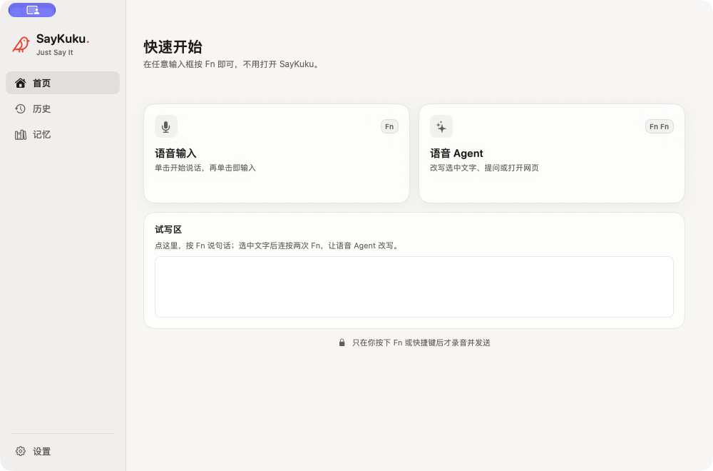
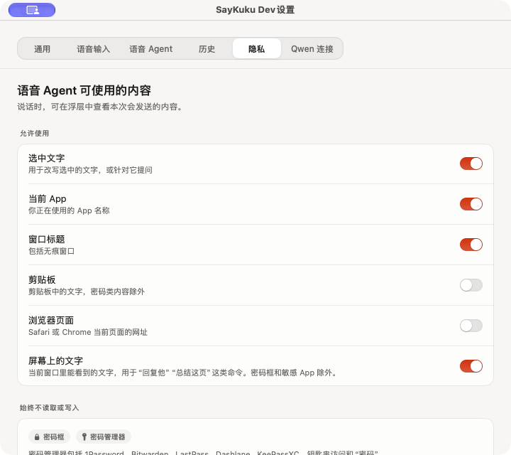

# SayKuku

[English](README.md) · [下载](https://say.anikuku.com/download/) · [配置指南](https://say.anikuku.com/guide/) · [隐私与权限](https://say.anikuku.com/privacy/)


*上图是宣传说明图；下方展示真实应用截图。*

SayKuku 是免费的原生 macOS 语音应用。按 **Fn**，在光标处语音输入；连按两次 **Fn**，让 Voice Agent 改写选区、翻译、回答问题或继续对话。语音处理使用 Qwen 云端模型，需要自备阿里云百炼 API Key，模型费用由自己的账号承担。

## 两种说话方式

| 手势 | 能做什么 |
| --- | --- |
| **Fn** | Voice Input 将语音转成文字，并尝试写入原光标位置。可选择按住说话，或单击开始、再次单击结束；识别语言、数字格式和口癖整理可在设置中调整。 |
| **Fn Fn** | Voice Agent 根据口述要求和你允许的上下文改写、翻译、回答或追问。写入前会检查原目标。运行快捷指令总需确认；打开链接或搜索网页时，若用到了不可信上下文，也需确认。 |

也可使用可配置的全局快捷键，默认 `⌃⌘V` 对应语音输入、`⌃⌘A` 对应 Voice Agent。语音输入可设为单按修饰键，此时语音 Agent 可选连按两次同一个键。跨应用写回取决于目标 App 的文本控件，发送重要内容前请核对结果。

## 应用界面



*首页截图来自已签名的开发版。*



*隐私设置截图也来自开发版。两张均为真实界面；[截图说明](marketing/assets/screenshots/README.md)记录了来源和使用范围。*

## 开始使用

需要 macOS 15 或更新版本、可访问 Qwen 的网络，以及自己的 Qwen API Key。模型调用可能产生费用。

1. 从[官网下载经过签名与公证的 DMG](https://say.anikuku.com/download/)，将 SayKuku 拖进“应用程序”。
2. 打开 App，按引导授予**麦克风**与**辅助功能**权限。辅助功能用于识别 Fn 手势、读取获准使用的选区，以及向其他 App 写入文字。
3. 选择与 API Key 对应的 Qwen 地域，填入 Key；若账号使用业务空间，再配置 Workspace ID。Key 保存在 macOS 钥匙串。
4. 将光标放入输入框，按 **Fn** 开始听写；选中文字后连按两次 **Fn** 试用 Voice Agent。

如果 Fn 与 macOS 键盘设置冲突，可按 App 内引导调整，或改用全局快捷键。[配置指南](https://say.anikuku.com/guide/)有权限与 Qwen 连接的详细步骤。

## 更多功能

- **记忆：**手动添加人名、项目、组织和术语，从粘贴文本中挑选建议，或在听写后确认纠正；可在“记忆”页查看和修改。
- **历史：**搜索记录、回放已保存录音、在有录音时重试失败听写，以及加星标或删除。Voice Agent 最近对话只在内存中保留最多 30 分钟，退出即清除。
- **设置：**调整输入方式、浮层位置、语言、快捷键、自动写回、上下文来源、历史保留期限和使用统计。界面支持英文与简体中文。

## 隐私与数据

| 数据或权限 | 实际处理方式 |
| --- | --- |
| 麦克风 | 只在语音输入、Voice Agent 或麦克风音量测试时采集。语音音频发往所选 Qwen 地域；音量测试不保存、不上传。 |
| Voice Agent 上下文 | 默认允许读取选中文字、当前 App、窗口标题与当前窗口可见文字；剪贴板和 Safari/Chrome 页面网址默认关闭。每项均可在**设置 → 隐私**单独控制。可见文字最多 2000 字，只随当次请求发送，不写入历史或日志；语音输入不读取屏幕文字。 |
| 本机数据 | API Key 存在钥匙串。历史、记忆和纠正建议保存在 Application Support 的 `store.json`，已保存录音在 `Audio/*.wav`；这些 JSON/WAV 文件没有额外加密。 |
| 历史默认值 | 新历史默认保留 30 天，保存录音默认开启；已加星标的记录不会自动删除。选择**设置 → 历史 → 不保存**后，不再新增历史和录音，但不会自动删除旧记录。 |
| 使用统计 | 正式版默认向自部署的 Umami 发送随机安装 ID、App 版本、固定事件名及完成内容的字符数；不发送语音、文字内容、窗口标题、网址或 API Key。可在**设置 → 隐私**关闭；开发版和测试不发送。 |
| 更新检查 | 正式版启动后和之后定期读取版本文件；可在**设置 → 通用**关闭自动检查。发现新版本时在浏览器打开下载页，不在 App 内安装。 |

焦点位于安全输入框或已知密码管理器时，SayKuku 会阻止录音和内容读取。无痕浏览窗口不会被单独识别。App 不申请输入监控权限，也不记录按键。开启可选上下文前，建议阅读完整的[隐私与权限说明](https://say.anikuku.com/privacy/)。

## 开发与贡献

项目使用 Swift 6、SwiftUI、AppKit 和 Swift Package Manager，没有第三方 Swift Package 依赖。运行目标为 macOS 15+；打包需要 Xcode 26 或更新版本提供的 macOS 26 SDK。

```bash
swift test
Scripts/package-app.sh debug
open Build/SayKuku.app
```

开发包需要稳定的 Apple Development 签名身份。`swift run SayKuku` 适合源码级调试，但其进程身份与资源不等同于已签名 App Bundle；验证权限、钥匙串、菜单栏和资源时，请使用打包后的 App。默认测试不依赖真实 Qwen API、网络、麦克风或辅助功能授权。

| 内容 | 位置 |
| --- | --- |
| App 与界面 | [`Sources/SayKuku/`](Sources/SayKuku/) |
| 测试 | [`Tests/SayKukuTests/`](Tests/SayKukuTests/) |
| 产品与实现说明 | [`SayKuku.md`](SayKuku.md) |
| 本机打包与发布 | [`docs/LOCAL_PACKAGING.md`](docs/LOCAL_PACKAGING.md) |
| App 统计及隐私边界 | [`docs/APP_ANALYTICS.md`](docs/APP_ANALYTICS.md) |
| 写入兼容性测试计划 | [`docs/COMPATIBILITY.md`](docs/COMPATIBILITY.md) |
| 中英混说评测 | [`docs/MIXED_LANGUAGE_EVAL.md`](docs/MIXED_LANGUAGE_EVAL.md) |
| 开发与 Agent 约定 | [`AGENTS.md`](AGENTS.md) |

正式版由 `Scripts/release.sh` 在本机完成签名、公证和打包；仓库不使用 GitHub Actions 验证 macOS 发布包。请遵循[本机发布说明](docs/LOCAL_PACKAGING.md)，不要单独运行内部 Release 打包步骤作为发布流程。

## 许可证

SayKuku 源代码采用 [Apache License 2.0](LICENSE)。基于 Lucide 的图标素材附有[独立许可说明](Scripts/Resources/Licenses/Lucide.txt)。
